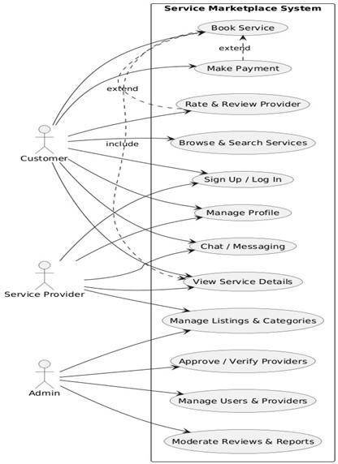
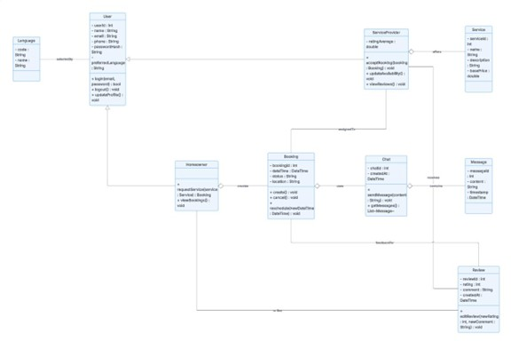
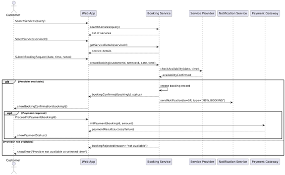
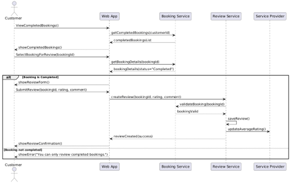
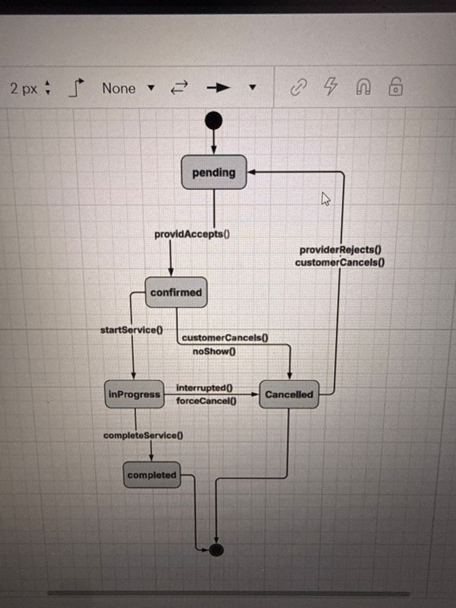
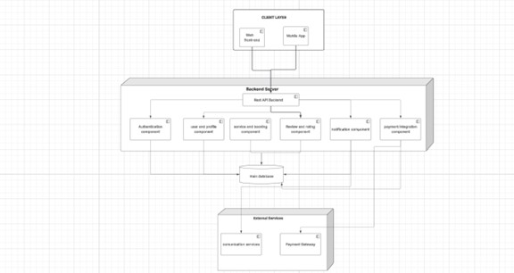

# 🏢 All Service Company

**Instructor:** Abdulbasit Faeq  
**Group ID:** G-10  
**Project:** All Service Company  
**Students:** Omar Emad, Rekar Muhammed, Abdulla Bestun, Dldar Bahri, Mahmood Kosrat  

---

## 📘 Overview
All Service Company is a web-based platform that connects users with trusted and verified service providers across different industries.  
It helps people easily find, request, and manage services in one place — making daily life faster, easier, and more reliable.  
Our mission is to build a trusted digital bridge between clients and professionals.

---

## 🎯 Goals
- Build a trusted all-in-one marketplace for services.  
- Provide secure and verified service providers.  
- Enable user reviews and transparency.  
- Help local professionals find more job opportunities.

---

## 📁 Repository Structure
All_Service_Company/  
├── docs/ → Reports and documentation  
│   └── REQUIREMENTS.md  
├── frontend/ → User interface (HTML, CSS, JS)  
├── backend/ → Server and database logic  
└── README.md → Main project description  

---

## 👥 Team Members
| Name | Role |
|------|------|
| Omar Emad | Developer |
| Rekar Muhammed | Designer |
| Abdulla Bestun | Frontend Developer |
| Dldar Bahri | Backend Developer |
| Mahmood Kosrat | Database & Testing |

---

## 🧩 Conclusion
All Service Company aims to make daily life simpler by providing a safe, verified, and efficient system.  
It builds trust, saves time, and supports professionals — a foundation for future digital expansion.

## Assignment 4 – System Design & UML Modelling

This assignment focuses on designing the HomeService App using UML diagrams based on the requirements defined in Assignment 3.

### Use Case Diagram (Omar Emad)

### Class Diagram (Abdulla Beston)

### Sequence Diagram – Book a Service (Omar Emad)

### State Diagram – Booking Lifecycle (Dldar Bahri)

### Component Diagram (Mahmud Kosrat)

### Deployment Diagram (Rekar Mhamad)

## Assignment 5 – Architecture, Design Patterns, Interfaces & Testing

In this assignment, we focused on explaining the architectural decisions and testing strategy of the HomeService App based on the system design from Assignment 4.

### Architecture Design
The system follows a Client–Server architecture combined with a layered structure. This design supports scalability, improves security, and separates responsibilities between presentation, application, and data layers.

### Design Patterns
- The MVC pattern was applied to separate the user interface from business logic, making the system easier to maintain.
- The Observer pattern was used to notify users when the booking status changes.

### Interface Design
We defined a Booking Service interface that includes operations for creating, updating, and managing bookings. This helps keep the system modular and easy to integrate.

### Testing Strategy
We prepared unit testing, integration testing, and system testing scenarios to ensure the system functions correctly and meets the requirements.

### Inspection & Quality Assurance
An inspection was conducted to identify possible defects and risks. Acceptance criteria were defined to ensure system reliability and quality.
