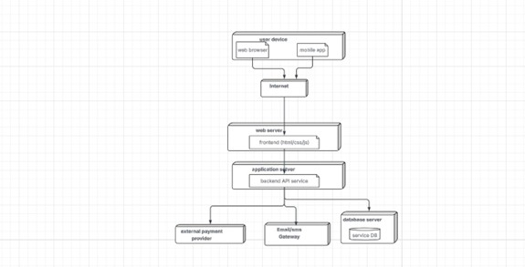

# UML Diagrams (Assignment 4) – images folder

This folder contains the UML diagrams for the **HomeService App (All Service Company)**.
These images document our **Assignment 4 – System Design & UML Modelling** work.

They explain:
- System interactions (Use Case + Sequence)
- System structure (Class)
- System behavior (State)
- System architecture (Component)
- System physical environment (Deployment)

## Team roles (who did what)
- **Omar Emad**: Use Case Diagram + Sequence Diagram 3 + Sequence Diagram 3.1
- **Abdulla Beston**: Class Diagram
- **Dldar Bahri**: State Diagram
- **Mahmud Kosrat**: Component Diagram
- **Rekar Mhamad**: Deployment Diagram

## Diagram list (current filenames)

> Note: Filenames are currently generic (Picture1..).  
> We keep them to avoid broken links.

---

## 1) Use Case Diagram — (Omar Emad)
**File:** `Picture1.jpg`

This diagram shows how the main actors (Customer, Service Provider, Admin) interact with the system and what functions the system provides.

---

## 2) Class Diagram — (Abdulla Beston)
**File:** `Picture2.jpg`

This diagram describes the system structure and main entities such as users, services, bookings, payments, reviews, and notifications, including relationships between them.

---

## 3) Sequence Diagram 3 — (Omar Emad)
**File:** `Picture3.png`

This sequence diagram explains one main system scenario step by step (based on the assignment report).

---

## 4) Sequence Diagram 3.1 — (Omar Emad)
**File:** `Picture4.png`

This sequence diagram represents the second scenario (because we have two sequence diagrams).

---

## 5) State Diagram – Booking Lifecycle — (Dldar Bahri)
**File:** `Picture5.jpg`

This diagram shows the booking lifecycle and how it moves between states (for example: Pending → Confirmed → InProgress → Completed / Cancelled).

---

## 6) Deployment Diagram — (Rekar Mhamad)
**File:** `Picture6.jpg`

This diagram shows the physical deployment environment where user devices access servers and external services.

---

## 7) Component Diagram — (Mahmud Kosrat)
**File:** `Picture7.jpg`

This diagram presents the system’s logical components (client layer, backend modules, database, and external services).

